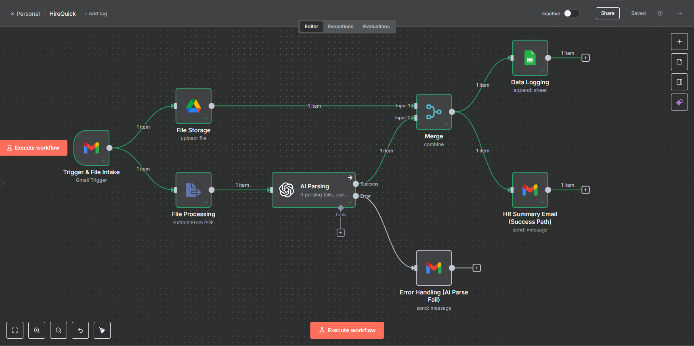
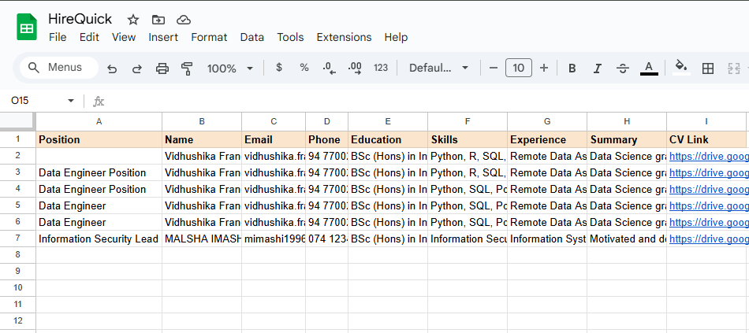
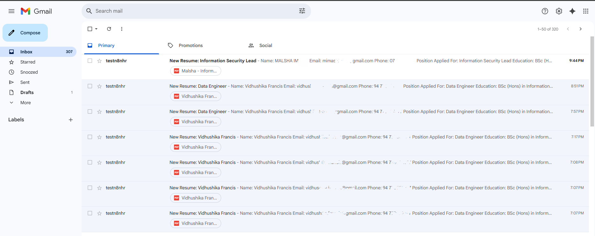
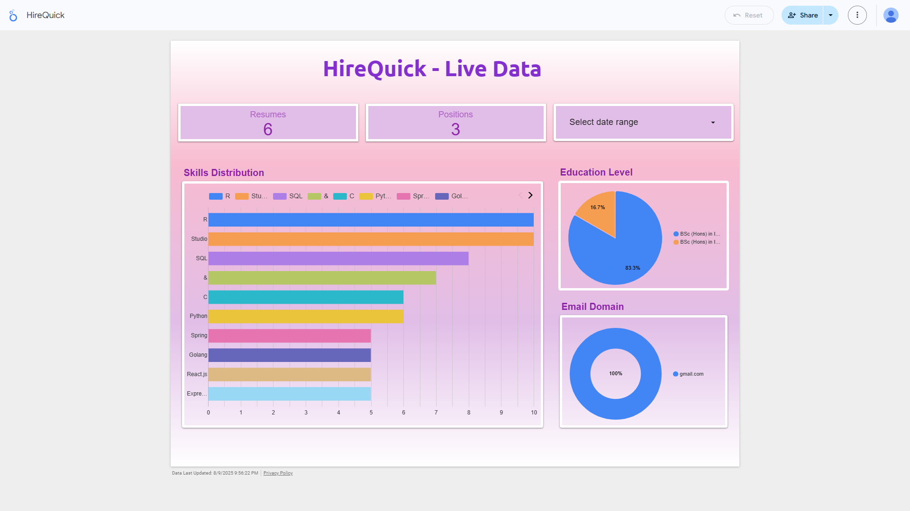

# HireQuick – n8n Resume Automation Workflow

## 📌 Overview
This workflow automates the process of:
1. Receiving CVs via Gmail.
2. Extracting resume text from PDF.
3. Parsing details with OpenAI (Name, Email, Phone, Education, Skills, Experience, Summary, Position Applied).
4. Saving CV to Google Drive.
5. Logging candidate data in Google Sheets.
6. Sending HR a formatted email with CV link and dashboard link.
7. Handling errors (manual review email if parsing fails).

**n8n Workflow:**  

---

## ⚙️ Setup
1. Import `hirequick.json` into n8n.
2. Set up credentials for Gmail, Google Drive, Google Sheets, and OpenAI.
3. Update HR email, Google Drive folder, and Google Sheets document in the workflow.

## 🔑 API Keys Used
- Gmail API – Fetch and send emails
- Google Drive API – Store CVs & generate share links
- Google Sheets API – Log structured data
- OpenAI API – Parse resumes into structured fields

**Google Sheet:**  

  

**HR Email:**  

---

## 📊 Dashboard

[**Click here to View Live Dashboard**](https://lookerstudio.google.com/reporting/8e2c0a3e-d6e4-4e20-96f1-2c6e2e5fca9b)

**Dashboard Screenshot:**  

---

## 📹 Video Demo

[**Click here to Watch Video Walkthrough**](https://drive.google.com/drive/folders/1UPc8PFf0yrVH71ei057wf8K283g7bIaP?usp=sharing)

